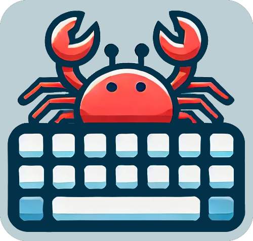
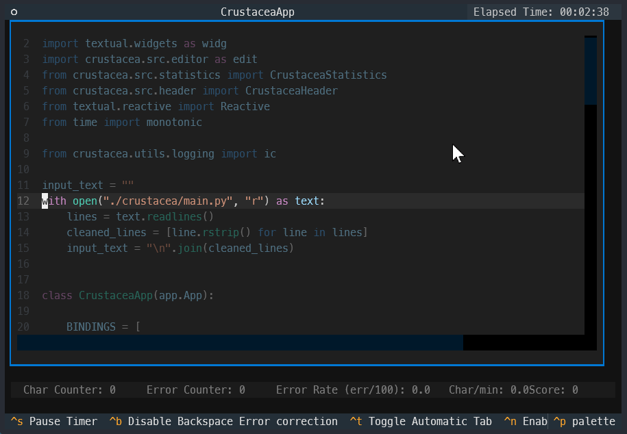
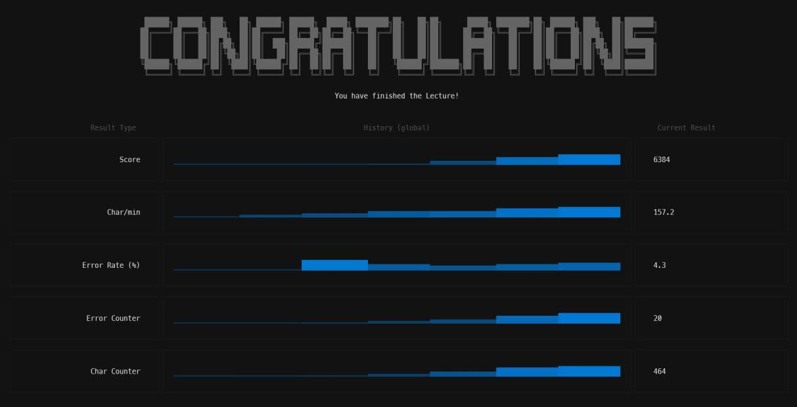

<!-- PROJECT LOGO -->
<br />
<div align="center">
  
  <h1 style="margin-top: 0;">CRUSTACEA</h1>
  <p align="center">
    A ten fingers typing training TUI-App in python based on TEXTUAL!
    <br />
    <a href="https://github.com/ManuelSchenk/crustacea/issues/new?labels=bug&template=bug-report---.md">Report Bug</a>
    &middot;
    <a href="https://github.com/ManuelSchenk/crustacea/issues/new?labels=enhancement&template=feature-request---.md">Request Feature</a>
  </p>
</div>
<br />

<!-- ABOUT THE PROJECT -->
## About The Project

This Application is for people who wants to learn or improve there ten fingers typing skills.
You can use your own texts or scripts in your favorite programming language with common syntax highlighting to get faster and more efficient in your everyday working.

<div align="center">
    
</div>

#### It provides the following features:
* its a terminal based text editor (TUI).
* on startup you can choose the text you want to train on. Use one of the example scripts or add your own in the `crustacea/texts` folder before starting the app.
* It uses the default color theme of "vscode_dark" (others are possible but not implemented yet)
* It provides syntax highlighting for the most programming languages and file formats with tree-sitter (bash,css,go,html,java,javascript,json,markdown,python,regex,rust,sql,toml,xml,yaml)
* provides some live statistics about your typing performance (Error Rate, Score, ...)
* multiple difficulty levels in form of "typing options" are provided like **auto tabbing**, **auto return** and **auto backslash** (as default a backslash is forced after each typing failure), to customize your difficulty level
* you can enable cursor navigation to jump to the part of your file you want to train with 
* after a lection is finished it shows you the current results (statistics) in numbers and also "sparklines" of the history of your previous results to visualize your progress.


#### Example TUI visualisation:
<div align="center">
    
</div>
 
Of course, the app do not provide all features i have planed (see [[roadmap]]) or you are looking for now since your needs may be different. 
So I'll be adding more in the near future. You may also suggest changes by forking this repo and creating a pull request or opening an issue. 

<br />

<!-- GETTING STARTED -->
## Getting Started


### Prerequisites

* Install Python ">=3.10,<4.0.0" 
* Install Poetry (only for development)

### Installation


1. Clone the repo
   ```sh
   git clone https://github.com/ManuelSchenk/crustacea.git
   ```
2. Change into the project working directory
   ```sh
   cd crustacea
   ```
3. install package into your local python (Alternatively use POETRY, see below)
   ```js
   pip install .
   ```
4. [optional] place your own scripts in `./crustacea/texts` to train on them.
5. run CRUSTACEA with python
   ```sh
   python -m crustacea
   ```


<!-- USAGE EXAMPLES -->
## Usage

Run CRUSTASEA with the following command in the project folder:
   ```sh
   python -m crustacea
   ```
HINT: If you want to train in your own scripts just copy the file into `./crustacea/texts` before you start the app!

In the Footer you see all the options which can be toggled with keyboard shortcuts:
* `ctrl+q` - **Quit the app and return to the command prompt.**
* `ctrl+s` - **Pause Timer, if you want to make a break while training on a text.**
* `ctrl+b` - **Disable default behavior: if your make a typing fault you have to correct it with Backspace.**
* `ctrl+r` - **Uses Return automatically at the end of a line.**
* `ctrl+t` - **If your press Enter at the end of a line you jump to the next not empty line. If want to type the TABS manually you can use this**
* `ctrl+n` - **Enables the Cursor Navigation, so you can jump to the next part of your text you want to train your skills on**

Your current statistics will be shown above the footer line.
Your history and progress will be visualized at the end of each lecture:
<div align="center">
    
</div>


## for DEVs

### Use poetry for installation 
(only this make the textual dev tools available)

1. Clone the repo:
   ```sh
   git clone https://github.com/ManuelSchenk/crustacea.git && cd crustacea
   ```
2. Install DEV environment with poetry:
   ```js
   poetry install
   ```
3. Run CRUSTACEA with python:
   ```sh
   poetry run python ./crustacea
   ```

### Debugging

You can easily use VSCode debugger on this project with the provided `./.vscode/launch.json`. Just press **F5** when you have the project folder of crustacea open in vscode.


<!-- ROADMAP -->
## Roadmap

- [x] provide beginners lections with reduced key set 
- [x] store the results/scores in a sqlite 
- [x] visualize the score history of your last results per file

See the [open issues](https://github.com/ManuelSchenk/crustacea/issues) for a full list of proposed features (and known issues).


<!-- CONTRIBUTING -->
## Contributing

Contributions are what make the open source community such an amazing place to learn, inspire, and create. Any contributions you make are **greatly appreciated**.

If you have a suggestion that would make this better, please fork the repo and create a pull request. You can also simply open an issue with the tag "enhancement".
Don't forget to give the project a star! Thanks again!

1. Fork the Project
2. Create your Feature Branch (`git checkout -b feature/AmazingFeature`)
3. Commit your Changes (`git commit -m 'Add some AmazingFeature'`)
4. Push to the Branch (`git push origin feature/AmazingFeature`)
5. Open a Pull Request


<!-- CONTACT -->
## Contact

Manuel Schenk - [linkedin-url](linkedin-url)

Project Link: [https://github.com/ManuelSchenk/crustacea](https://github.com/ManuelSchenk/crustacea)


<!-- ACKNOWLEDGMENTS -->
## Acknowledgments

This app is built on [Textual](https://textual.textualize.io/), an innovative framework from **Will McGugan** that empowers developers to create modern, interactive, and highly customizable terminal user interfaces. Leveraging Python’s asynchronous capabilities and the advanced rendering features of the Rich library, Textual streamlines the development of dynamic, responsive, and visually engaging TUI applications.

For more information and resources, please refer to the following documentation:
- [Textual Documentation](https://textual.textualize.io/)
- [Textual GitHub Repository](https://github.com/Textualize/textual)
- [Textual Tutorials](https://textual.textualize.io/tutorials/)

---


<!-- MARKDOWN LINKS & IMAGES -->
<!-- https://www.markdownguide.org/basic-syntax/#reference-style-links -->
[issues-url]: https://github.com/ManuelSchenk/crustacea/issues
[linkedin-url]: https://www.linkedin.com/in/manuel-schenk-48246117a/
[product-screenshot]: crustasea.png


